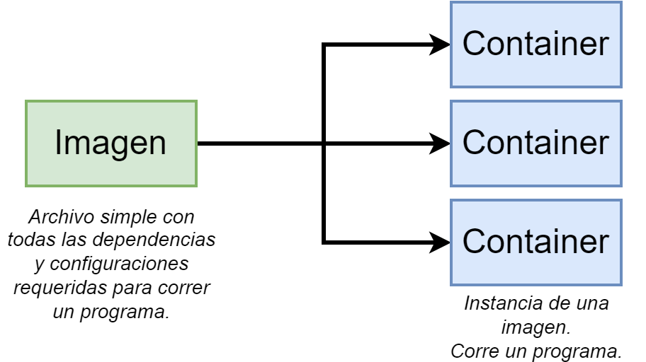
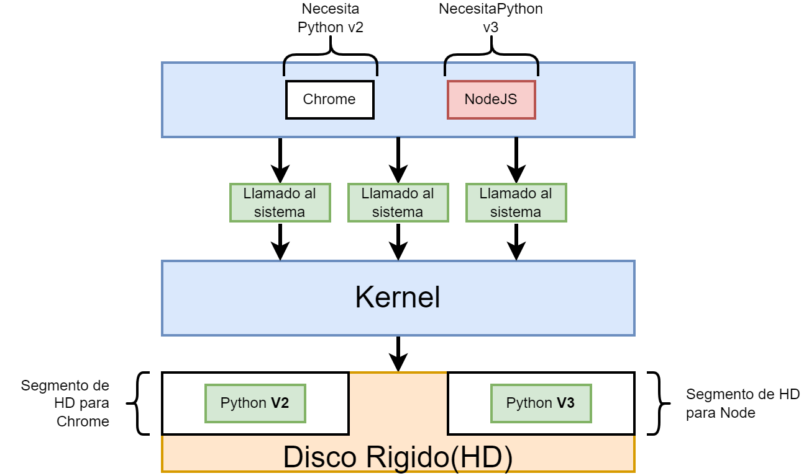

# Curso de Docker para la Dirección de Información Geoespacial

Este repositorio tiene el objetivo resguardar distintos ejemplos de herramientas útiles para el desarrollo orientado a la DIG.
Se compone de distintos directorios con recetas de imágenes de Docker.

## Docker TODO

  * [ ] Porque Docker y que es Docker
  * [ ] Panorama general del proceso de build, ship y run
  * [ ] Imagen
    * [ ] Que es
    * [ ] Como se usa
  * [ ] Contenedor
    * [ ] Que es
    * [ ] Como se usa
  * [ ] Ejemplos varios
  * [ ] Proximamente...


## Que es Docker?





## Porque se usa Docker?


Docker hace mas facil la instalacion de software sin preocuparse acerca de la configuracion o dependencias.

Basicamente resuelve 3 grandes campos:
* Aislacion (Isolation)
* Ambientes (Environments)
* Velocidad del negocio


## Que innovaciones trae docker?

Conceptos claves en el ecosistema de contenedores de Docker:
* docker image
* docker registry
* docker container

### Workflow de los contenedores


## Docker Client y Docker Server


## Como obtener Docker


Una vez instalado Docker se debe iniciarlo.
Esto significa hacer correr tanto su Docker CLI como su Docker Server.
En Windows se hace mediante un solo paso abriendo el Docker Desktop.

## Version de Docker

Para verificar version y su correcta instalacion:

```bash
docker version
```
Observaciones:
* Observar que el host, osea el servidor siempre es Linux
* Si se corre el comando en una maquina con Windows:
  
* Si se corre el comando en una maquina con Linux:
  

***
***

# Imagen

## Que es una imagen?

* Una imagen se la puede pensar como paquete universal de aplicaciones/software.
* Una imagen es una especia de "foto" (snapshot) de archivos de sistemas necesarios para correr un programa en un contenedor. 
* Tambien tiene un comando de inicio.


## Ciclo de descarga de una imagen


## Como se usa una imagen?

### Listar imagenes en cache

```bash
docker images
```

### Descargar una imagen de la nube

```bash
docker image pull <id/tag de la imagen>
```

### Borrar una imagen

```bash
docker image <id/tag de la imagen>
```

### 

***
***

# Contenedores

## Que es un contenedor?


*** 

Ejemplo


*** 



*** 


*** 

Estas acciones estan preparadas para usarse en sistemas operativos Linux.


***


***

Conclusiones de que es un contenedor

* Un contenedor es un proceso corriendo que posee un subconjunto de recursos fisico de una computadora.
* Asegura un identico runtime environment


***


***

Imagen completa de como corre un contenedor sobre sistemas operativos como Mac o Windows.


***

## Como se usa un contenedor?

### Crear y correr un contendor

Para crear y correr un contenedor a partir de una imagen se usa el siguiente comando:

```bash
docker container run <nombre de imagen>
```


***


***

Sobreescritura del comando inicial


***

## Crear y correr contenedores

### Listar contenedores activos


***

### Crear y correr


***


***

## Ciclo de vida de un contenedor


 
***
### STDIN STDERR STDOUT

* `-a` attach
* `-d` detach


***

## Logs


*** 

### Como parar o matar un contenedor


***

```bash
docker container stop <id del contenedor>
```


***

```bash
docker container kill <id del contenedor>
```


***

### Ejecutar comandos dentro de un contenedor


***

## Borrar contenedores parados

```bash
docker system prune
```

***

## Borrar contenedores

```bash
docker container rmi <id/tag de la imagen>
```

<!-- ***

## 

```bash
docker 
``` -->

***

## Como crear una imagen a traves de Dockerfile

Proceso iterativo mediante uso de la terminal interior del contenedor.

> Tip:
> Cada linea del Dockerfile es una capa al momento de construir una imagen.
> La variacion de debe ser menor desde las primeras lineas.
> Ordenar bien un Dockerfile ayuda a que ante variaciones de la receta para construir una imagen sea un proceso mas rapido al reutilizar cache de las capas.

***
***

# Proximamente...

Temas a seguir investigando

* Como subir imagenes a la nube, Docker Hub. Distribucion universal de software.
* Orquestacion de contenedores

## Docker Hub como subir imagenes

***
***

# Orquestacion de contenedores

## Docker Compose


***

## Cheatsheet

```bash
docker version

docker <comando> --help
docker version --help

docker images --help
docker images

docker image build --help
docker image build -t <tag/nombre que va a tener la imagen> <ubicacion Dockerfile>
docker image build -t <usuario>/<imagen> .


docker container ps --help
docker container ps

docker container ls --help
docker container ls

docker container run --help
docker container run <nombre de imagen>
docker container run <nombre de imagen> <nuevo comando inicial>
docker container run --name <nombre que va a tener el contenedor> <nombre de imagen>
docker container run --rm --name <nombre que va a tener el contenedor> <nombre de imagen>

docker container create --help
docker container create <nombre de imagen>
docker container create <nombre de imagen> --name <nombre que va a tener el contenedor>
docker container start --help
docker container start <ID del contenedor>

docker container logs --help
docker container logs <id del contenedor>

```

***
***

## Jupyter Minimal Notebook (jupyter_minimal_notebook)

Jupyter Docker Stacks are a set of ready-to-run [Docker images](https://hub.docker.com/u/jupyter) containing Jupyter applications and interactive computing tools.
You can use a stack image to do any of the following (and more):

- Start a personal Jupyter Server with the JupyterLab frontend (default)
- Run JupyterLab for a team using JupyterHub
- Start a personal Jupyter Notebook server in a local Docker container
- Write your own project Dockerfile

We are going to use Jupyter Minimal Notebook from the all set of this stack.

[jupyter/minimal-notebook](https://hub.docker.com/r/jupyter/minimal-notebook) adds command-line tools useful when working in Jupyter applications.

It contains:

- Everything in jupyter/base-notebook
- Common useful utilities like git, nano (actually nano-tiny), tzdata, unzip and vi (actually vim-tiny),
- TeX Live for notebook document conversion

En el sitio web [towardsdatascience](https://towardsdatascience.com/how-to-run-jupyter-notebook-on-docker-7c9748ed209f) pueden ver un tutorial completo de cómo desplegar jupyter/minimal-notebook

Un listado completo de versiones de imágenes se encuentra en [https://github.com/jupyter/docker-stacks/#using-old-images](https://github.com/jupyter/docker-stacks/#using-old-images).

## Postgres with Postgis (postgres_postgis)

The [postgis/postgis](https://hub.docker.com/r/postgis/postgis) image provides tags for running Postgres with PostGIS extensions installed. This image is based on the official postgres image and provides debian and alpine variants for PostGIS 3.3.x for each supported version of Postgres (11, 12, 13, 14 and 15). Additionally, an image version is provided which is built from the latest two versions of Postgres (14, 15) with versions of PostGIS and its dependencies built from their respective master branches.


## Borrar

* A container is a running process along with a subset of physical resources on your computer, (Verlo en Windows como proceso)
that are allocated to that process specifaclly
* An Image is a really kind of snapshot of the file system, along with a very specific startup command as well
* How separate resources? Through a cuople of techniques called Namespacing(isolating resources per/group process/es) 
and Control Groups(Limit amount of resources used per process)
	* It is specific of Linux OS that techniques, belong to that OS
	* docker version --> server always run on linux machine


docker version
docker <sub command> --help

docker run <image>
docker container run <image>
docker container run -it <image> <new startup command>
ex: docker container run -it <image> <new startup sh
docker container run <image> --name <name>
see the container isolation, modify with sh/touch 

overriding default commands
How to override the startup command
try to replace to commands that the container can interpreted
* --> Can make bash script

docker ps (show only running containers)
docker containter ps	
docker container ps --all (shows every container that have been created)
We can see the containers's IDs

docker create <image>
kind of prepping or setting file-system snapshot to be used to create the container
it is about file-system
save the Id

docker start -a <ID_container>
-a basically watch for output from the container and print out on my terminal
docker container start --help
STDIN, STDOUT, STERR
that is when execute its startup command
it is about executing startup command
Once a container was created/run can not change the startup command

docker system prune

How to read the output without the additional flags?


docker container logs <container id>
get logs from the container ran

docker container stop <container id> (send process signal SIGTERM, do additional work before shutdown. 10 seconds later docker KILL the process) RECOMMENDED
docker container kill <container id> (shutdown rigth now, and dont do any additional work)

docker container exec -it <container id> <command>
-i attach STDIN to the running process
-t text pretty moreless
ex: command = sh

shell/terminal access


***

# What is docker

Docker innovations
* docker image
* docker registry
* docker container

Steps
* Build -> image
* Ship -> registry
* Run -> container

CNCF = Cloud Native Computing Foundation
OCI Standard

Image is
Registry is
Container is


# Why Docker


isolation
reduce infrestructure

Container give isolation like VMs. But without entire OSs

Speed of business, to execute ideas to deliver their software ideas to the customer as fast is possible